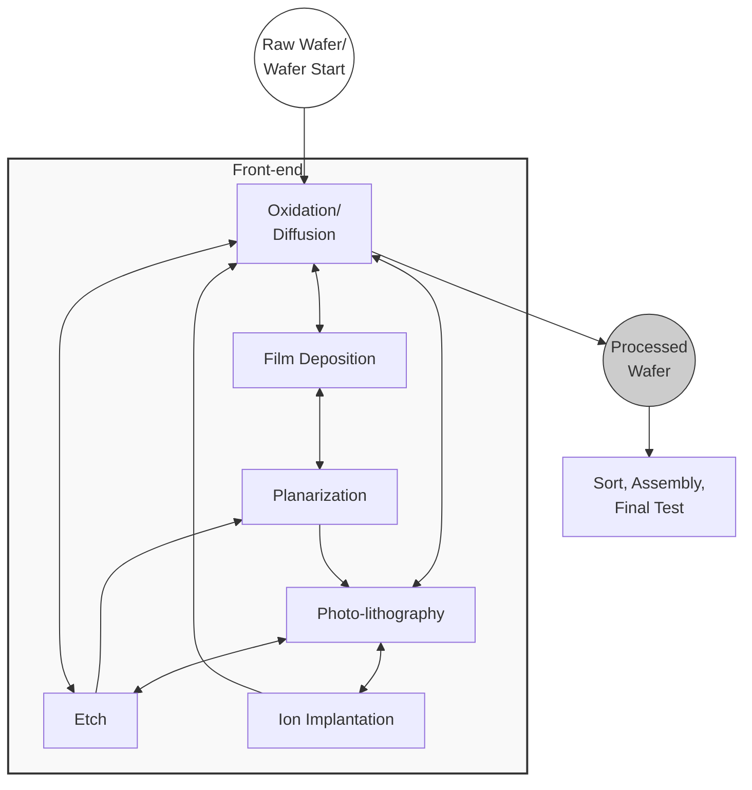

# Contents

- TOC
  {:toc}

## preface

- Wafer fabrication이 복잡한 이유
	- Reentrant flow : 노광 장비가 고가이기 때문에 식각, 증착 과정에서 동일한 장비를 하나의 Wafer(job)이 여러 번 통과함
	- Customer due date이 매우 aggressive함
	- 다른 제품 만드려고 할 때 lead time에서 setup time이 차지하는 비율이 큼

- Semiconductor manufacturing system
	- base system (BS): 모든 resources를 포함한 개념
		- base process : jobs들이 resources를 소비하며 처리되는 것
	- production control system : production control instructions를 생산하기 위한 컴퓨터와 소프트웨어
		- production control process

- PPC (Production Planning and Control) hierarchy
	- Planning(months or years) : Enterprise level에서 장기 수요를 예측
	- Order release(weekly) : planning을 바탕으로 생산 용량을 할당
	- Scheduling(shift or day) : 시간 흐름에 따라 resource를 할당
	- Dispatching(minute-by-minute) : 실시간 resource의 상황에 따라 job 간의 우선순위를 정하거나 할당

- scheduling
	- deterministic : processing time, setup time, job priority가 확정적
		- static : 모든 작업이 t=0일 때 가용 상태
		- dynamic : 작업 마다 가용 시간이 다름
	- stochastic : 확정적이지 않고 확률 분포를 따름

반도체 공장의 많은 스케줄링 문제는 NP-hard라서 heuristic 또는 강화학습 알고리즘을 사용함  

## Semiconductor Manufacturing Process Description

- Front-end
	- Wafer Fab
	- Sort(Probe)
- Back-end : 주로 노동비가 싼 국가에서 이뤄짐
	- Assembly : dicing saw, die attach, wire bonding, lid sealing, packaging, molding
	- Test : wafer sort와 비슷한 검사, load board에 올려서 heat-stress test
		- tester(test system)
		- handler(loading mechanism)

- performance measures
	- utilization : 장비 가격이 매우 비싸서 중요한 지표임
	- production yield
	- throughput
	- cycle time : job(a fixed number of wafers)이 공정에 머무는 시간
	- on-time delivery performance

- Basic Framework for PPC
	- system : 서로 상호작용하는 components의 집합
		- 각 component는 고유의 state를 가짐
	- process : events 집합에서 actions 집합으로의 mapping
		- event에 따른 action은 system component에서 수행됨
		
- manufacturing system : 상품을 생산하기 위한 목적을 가진 system으로 BS와 IS로 구성됨
	- Base system(BS) : raw materials이나 intermediate products를 final products로 변환하는 system components로 구성됨
		- Subsystems
			- Job processing system(JS) : working objects(i.e. jobs)의 value-added processing을 가능하게 하는 system components로 구성됨
				- 여러 work area(bay)로 구성되며 work area는 work center(tool groups)의 집함임. work center(tool groups)는 비슷한 처리를 하는 machines의 집합임.
			- Material flow system(MS) : raw materials, working objects, auxiliary를 저장하거나 옮기고 공급하는 시설로 구성됨
		- Base process : process flows(routes)와 working objects 집합으로 구성됨. working objects에 의한 BS의 system components의 사용에 대해 다룸
			- process flow : process steps으로 구성된 sequence로 각 process step에는 possible machines의 집합이 할당되고 각 machine에는 recipe이라고 불리는 execution program이 대응됨
	- Information system(IS) : production control을 하는 시스템으로 각 하위 subsystem은 instructions과 feedback을 통해 상호작용함
		- Planning system (PS) : 컴퓨터와 소프트웨어 집합으로 구성되며 production planning instructions인 mp를 결정하는데 사용되며, 이에 따라 working objects를 BS에 언제 어느 정도 투여할 지 결정함.
			- production planning process(PP)는 어떤 상황에서 어떤 production planning actions이 수행되어야 하는지 결정함.
		- Control system (CS) : 컴퓨터와 소프트웨어 집합으로 구성되며 BP에 영향을 주는 production control instructions mc를 결정하는데 사용되며, 이에 따른 production control decisions은 이미 BP의 일부인 working objects에만 영향을 줌. 
			- control process (CP) : 특정 production control algorithm을 통해 어떤 상황에서 어떤 production control instructions을 사용할지 결정함
		- Operational system (OS) : 하드웨어와 소프트웨어 집합으로 구성되며 BP의 긴급 제어를 담당함. BS와 BP의 mirror처럼 작동하며 데이터베이스를 통해 구현됨.
		- Human decision makers

### Base system

#### Job processing system

- JS를 이루는 machines
	- batch machine : batch 단위로 처리를 하는 machine
	- pipeline tools : first job이 끝나기 전에 second job을 시작할 수 있는 machine
	- X-piece machine : batch size 보다 작은 X개 wafer를 처리할 수 있는 machine
	- cluster tools : 진공 환경에서 wafer-handling robot을 통해 처리하는 machines
		- 동일한 recipe를 요구하는 jobs은 순차적으로 처리(pipelining)하고 아니면 병렬 처리도 가능

#### Material flow system

300mm wafer fabs에서는 wafers나 reticle이 AMHS를 통해서 FOUPs(안이 질소 포장됨)을 통해 이동함. FOUPs이 너무 많으면 AMHS에 과부화를 줄 수 있어서 무조건 많아서 좋은 것은 아님.  

- Interbay systems(=Interbay MS) : bay 간의 transport를 하는 system
	- 구성 요소
		- carrier
		- stocker(i.e. high-rack storage area) : wafers나 reticle을 저장
			- load ports가 있어서 carrier에 load하거나 unload할 수 있음
		- transportation system : stocker와 stocker 사이 또는 stocker와 interlevel lift system 사이에 수송을 담당
			- e.g. overhead transport, floor running AGV(automated guided vehicle)
- Intrabay systems(=Intrabay MS) : bay 내부에서 transport를 하는 system
	- 구성 요소
		- carrier
		- stocker : stocker와 machine의 거리가 멀기 때문에 이동 시간 동안 overhead가 발생하고 이를 피하기 위해서 UTS(under track storage)라는 single buffer에 미리 옮겨 놓음. machine의 load ports도 primary buffer 역할을 하고 보통 기계 마다 3-4개 ports가 있음
		- transportation system : stock와 machine 또는 machine과 machine 사이의 수송을 담당
			- e.g. 주로 OHV(overhead hoist vehicle, =OHT), AGV, RGV
	- 사용되는 Configuration이 크게 두 가지가 있음
		- unified transport configuration : interbay systems이랑 intrabay systems이 통합되어 있는 형태로 서로 옮겨 갈 때 stocker에서 load와 unload를 할 필요가 없음 (track elevation이 같아야 함)
		- non-unified transport configuration : 서로 분리된 형태 (track elevation이 다를 수 있음)

### Base process

- Work areas
	- Oxidation/diffusion : Oxidation은 산화막을 만드는 과정이고 diffusion은 furnace를 통해서 wafer 표면의 물질을 퍼지게 하는 과정
	- Photolithography : scanner가 비싸기 때문에 typical bottleneck임
		- coating : photoresist strip을 wafer에 코팅
		- exposure : exposure tools(scanner)을 통해서 reticle의 패턴을 wafer 위에 노출
		- developing : polymerized section이 제거되는 과정 
	- Etch : photoresist strip이 덮히지 않은 부분이 wafer에서 제거되는 과정으로 wet etch와 dry etch로 구분됨.
	- Ion implantation : etched된 부분에 doping material이 증착됨
	- Film deposition : dielectric(절연체) 또는 metal layer를 wafer 위에 증착하는 과정으로 PVD(physical vapor deposition), CVD(chemical vapor deposition), epitaxy, metallization이 사용됨
	- Planarization(=CMP; Chemical-Mechanical polishing) : slurry를 통해 wafer surface를 깍아서 평탄화하는 과정

Oxidation, diffusion, deposition 과정 진입 전에 cleaning step이 수행되며 job이 work area 사이에 옮겨 갈 때 inspection이나 measurement step이 수행됨  

특정 process step을 수행할 때 wafer가 damaged 될 수 있는데 rework를 통한 repair가 불가능한 경우의 wafer를 scrapped material이라고 부름  

- yield : electrical specifications을 만족하는 wafers의 비율

- job shop : 개별 제품 별로 필요한 공정이 다른 경우 (보통 공정 단계는 적음)
- flow shop : 모든 제품들이 fixed machine sequence를 따라서 처리되는 경우

반도체 제조는 고가의 장비 때문에 re-entrant flow가 필요하고 공정 단계가 매우 많기 때문에 전통적인 job shop이나 flow shop과 차이점이 있음 (하나의 장비를 두고 서로 다른 stage에 있는 job끼리 경쟁을 해야됨)  

어떤 공정은 금방 처리되지만 어떤 공정은 몇 시간이 걸리기도 하고 batch machine부터 한 번에 하나의 wafer만 처리할 수 있는 machine까지 다양함    

- multiple orders per job problem : batch machine에서는 order 마다 POUPs을 사용하기 보다는 적절히 합친 다음 batch 단위로 처리하는 것이 효율적임. 그래서 서로 다른 customers의 order를 group화 해서 production jobs을 형성할 필요가 있음.     

- 어려운 점들
	- 반도체 생산 장비는 기계가 완전 고장나는 hard failure는 드물고 기계는 돌아가는데 기준치를 벗어난 생산을 하는 soft failure가 발생하는 경우가 대부분임. 그래서 inspection step이 중요하고 preventive maintenance operations과 prototype jobs도 필요한데 capacity가 줄어들기 때문에 trade-off 관계임.     
	- 우선순위가 높거나 due date이 촉박한 hot jobs(rocket jobs)이 있으면 혼잡성이 더 올라감.  
	- time windows가 지나 버려서 wafer가 산화되거나 오염되면 rework를 해야될 수도 있고 scrapped material이 될 수도 있음
		- time windows(Q-Time) : 특정 공정에서 다음 공정까지 허용되는 최대 제한 시간
	- sequence-dependent setup times : setup time이 constant 일 수도 있지만 어떤 경우에는 이전에 어떤 작업을 했냐에 따라 setup time이 달라질 수 있음 e.g. ion implantation에서 이전에 어떤 dopant를 사용했냐에 따라 다음 작업 setup time이 달라질 수 있음
		- 이런 경우에는 각 setup time을 이전에 어떤 작업을 했냐에 따라 setup matrix로 저장
	- batch formation할 때도 chemical 성질이나 processing time에 따라 incompatible할 수도 있음

### Production Planning and Control Hierarchy

production planning은 time bucket 단위로 이뤄지며 planning decisions의 결과는 특정 bucket 내에 생산되어야 할 물량임. Planning level에서는 주로 매출이 measure로 고려됨   

#### PS
##### Planning

- planning의 종류
	- (long-term) capacity planning : enterprise level에서 다음 연도들의 생산량과 product mix를 결정하는 것
	- master planning(supply network planning) : capacity planning을 바탕으로 time buckets이나 facility에 물량을 할당하는 것
  
- PP의 performed manner
	- event-driven : BS의 state나 BP의 event를 고려해서 새로운 계획을 수립하는 방법.
	- time-driven (rolling horizon) : 상황을 고려하지 않고 주기적으로 계획을 수립하는 방법. h가 planning decision을 고려하는 전체 기간이라고 하면, $\tau_\Delta$는 계획이 BS, BP에서 실행되는 planning interval이고 $\tau_{ah}$는 additional planning horizon임     $$h:=\tau_\Delta +\tau_{ah} $$
	- hybrid : 혼합된 형태

##### Order release

- Order release : planning에 따른 decision을 바탕으로 quantities를 분할하는 과정
	- 보통 weekly or bi-weekly 수행하며 결과로 특정 시간에 처리되어야 할 jobs 집합이 나옴.  
	- Order release는 Fab의 load나 cycle time에 영향을 주고 planning decision에도 영향을 줄 수 있음.  

##### Scheduling

- scheduling : 각 job을 적절한 time intervals과 알맞은 resources를 할당하는 과정으로 특정 objective를 최적화하는 것이 목표임
	- 이미 BS에 release된 jobs만을 대상으로 하며 보통 day or shift 간격으로 수행
	- scheduling의 대상은 BS의 work area, work center, 또는 single machine이 될 수도 있고 MS의 vehicle이 될 수도 있음

##### Dispatching

- dispatching : JS나 MS의 resources에서 서비스를 대기 중인 jobs 집합 중에서 다음으로 처리될 job을 할당하는 과정.
	- schedule을 바탕으로 한 priority를 고려하거나 feasible schedule이 없으면 dispatching rule에 따라 결정하며 minute by minute으로 수행

#### others

- OS : BS나 BP에서 나온 데이터를 모으는 역할을 함
	- ERP는 planning decision을 돕는 소프트웨어
	- MES는 JS와 관련된 production control decision이나 AMHS control 같은 MS 관련 decision을 내릴 때 사용하는 소프트웨어
	- 근데 요즘은 더 발전된 APS같은 소프트웨어를 사용함
  
## Modeling and Analysis Tools

### Systems and Models

- Systems : components와 그것들의 interaction으로 구성되며 system이 environment와 상호작용하면 open 상태라고 하고 아니면 closed라고 한다.
	- Interaction : information, energy, material의 교환
	- 속을 알 수 없는 systems을 input-output systems(black box systems)이라고 한다

- Models : real systems의 특정 측면을 표현한 것 $$ M:=(S_O, S_M,f)$$
	- real original system : $S_O$
	- system components of $S_O$ : $V_O$
	- model : $S_M$
	- model components of $S_M$ : $V_M$
	- model mapping $f:V_O\rightarrow V_M$

$V_M$을 나타내기 위해서 파라미터 선정이 필요한데 wafer fab 같은 경우는 machine의 종류나 개수, process flow의 구조, job release rate이 파라미터임.   

- Model의 종류
	- 목적에 따른 분류
		- descriptive model : system components와 그것들의 관계에 대해서 묘사하여 system이 어떻게 동작하는지 나타내지만 왜 그렇게 동작하는지와 앞으로 어떻게 동작할지는 알 수 없음
		- prescriptive model : 여러 alternatives 중에서 하나의 action을 선택하는 모델
			- e.g. optimization model : objective functions과 constraints로 구성되며 constrains를 모두 만족하는 solution을 feasible하다고 한다
	- 시간에 따른 분류
		- static model : 특정 시점만 다룬 모델
		- dynamic model : 시간의 흐름에 따라 변화하는 모델
	- 결정론에 따른 분류
		- deterministic model : 모델의 모든 파라미터가 상수로 알려진 모델
		- stochastic model : 일부 파라미터가 확률 분포를 따르는 모델

### Decision methods and Descriptive models

- decision problem (=decision model, optimization model) : action 또는 sequence of actions 중에서 requirements를 만족하는 가장 좋은 feasible한 것을 찾는 문제
	- alternative feasible actions 집합과 objective functions으로 구성됨
- decision methods : decision problem에서 feasible or optimal solution을 찾는 방법

대부분 decision problem은 NP-hard에 속하기 때문에 heuristics을 사용하지만 소규모 데이터에서 heuristics의 성능을 평가하기 위해 optimal decision methods를 사용함.  

#### Branch-and-Bound Algorithms

기본적으로는 state space 전체를 탐색하는 알고리즘임  

- Branching : state space tree 형태로 문제를 subproblem으로 쪼갬
- Bounding : lower bound를 갱신해가면서 그것보다 낮으면 pruning함

#### Mixed Integer Programming (MIP)

일반적인 linear programming과 형식이 비슷한데 decision variables 중 일부 또는 전부가 정수 조건일 때 문제를 해결하는 방법  

보통 branch and bound나 cutting plane을 통해 해를 찾음  

#### Stochastic Programming

first stage에서 decision을 내리고 어떤 random event가 발생해서 first decision의 결과에 영향을 줬을 때, second stage에서 resource decision을 통해 보완할 수 있는 상황에서 해결 방법  

#### Dynamic Programming

optimal solution을 구할 때 subproblems의 optimal solution을 통해 구할 수 있는 경우의 해결 방법으로 single machine scheduling에 주로 사용  

#### Neighborhood Search Techniques and Genetic Algorithms

- Metaheuristics : 휴리스틱을 통해서 더 나은 local optima를 찾기 위한 방법론
	- Neighborhood Search Techniques : 현재의 solution을 neighbor로 move시켜서 local optima를 찾는 방법
		- simulated annealing(SA) : 초기에는 비개선 해도 탐색하고 시간이 지날 때 마다 개선된 해만 탐색하는 기법
		- Variable Neighborhood Search(VNS) : 여러 neighborhood structure를 번갈아 가며 사용하는 기법
	- Genetic Algorithms : 적자 생존을 모방한 알고리즘 (selection -> crossover -> mutation)

#### Queueing Theory

- calling population : service를 받으려고 하는 잠재적인 jobs
- queueing discipline : queue에 대기 중인 jobs 중 어떤 job에 먼저 serve할 지에 대한 규칙
- cycle time (CT) : arrival이랑 departure 사이 시간
	- service time : waiting time을 제외한 시간
	- CT = service time + waiting time
- work-in-process (WIP) : system에 머무르고 있는 jobs의 개수

- queueing system
	- steady state : 시간이 지나도 queue와 관련된 확률(state, queue length 등)이 바뀌지 않는 상태를 말하며 이 경우에는 CT랑 WIP가 initial condition에 영향을 받지 않는다.
		- steady state에서는 Little's Law가 성립한다. $$\text{WIP}=\lambda\cdot \text{CT} $$
			- 이때 $\lambda$는 input rate(=arrival rate, throughput)을 의미함
			- steady state의 M/M/1 queue에서 state가 n일 확률을 $p_n$이라고 하면  $$\begin{flalign}p_n&=P(N=n)=(1-\frac{\lambda}{\mu})(\frac{\lambda}{\mu})^n\\\text{WIP}&=\sum^\infty_{n=0}n\cdot p_n=\frac{\lambda}{\mu-\lambda}\\\text{CT}&=\frac{1}{\mu-\lambda}\end{flalign}$$
			- Kingman approximation : 분포가 포아송이 아닌 임의 분포를 따르는 경우의 CT $$ \text{CT}_q=E(T_q)\approx(\frac{C_a^2+C_s^2}{2})(\frac{u}{1-u})E(T_s)$$
				- $T_s$ : random variable of service time
				- $C_a$ : arrival time의 변동 계수
				- $C_s$ : service time의 변동 계수
				- $u=\frac{\lambda}{\mu}$
				- (변동 계수는 표준편차를 평균으로 나눈 값)
	- five-field notation by Kendall : arrival의 분포/departure의 분포/server 수/queue capacity/(optional)system이 사용하는 queueing discipline
	- 근데 실제 현장에 들어맞지는 않음 : Fab에서는 arrival이랑 departure가 independent하지 않음, queueing theory가 의미 있으려면 steady-state여야 하는데 그렇지 않은 경우도 많음. re-entrant한 특성 때문에 전체 모델링이 어려움. analytic solution을 구할 수가 없음.

#### Discrete-Event Simulation(DES) Techniques 

사용 이유 : queueing theory는 arrival이나 departure가 특정 확률 분포를 따른다는 가정을 바탕으로 만들어진거라서 현실에서는 impractical 할 수 있음.   

- simulation : time-dependent manner로 process를 설명하는 것
	- discrete event simulation : future events의 timing이 결정된 후에 next future event로 점프하는 방식이고 보통 시간 간격이 동일함
	- continuous simulation : 무한히 많은 time step이 존재하는 경우라고 생각하면 됨
  
- simulation model for a wafer fab $S_M$
	- components
		- equipments
		- operators and secondary resources
		- material handling과 관련된 components
		- process flow
	- JS-related modeling : cluster tools을 제외하고는 internal behavior는 신경 안써도 괜찮음
		- machine-related parameters : machine group의 이름, machine의 이름, group에 속한 machine의 수, batch-size, setup time, preventive maintenance cycles(장비의 maintenance를 위한 작업 주기), batch formation criterion(어떤 jobs끼리 batch를 형성할 수 있는지에 대한 정보), breakdown-repair cycles(time-to-repair(TTR)와 time-to-failure(TTF) 확률 분포로 구성. 만약 failure가 고쳐지는 도중에 또 failure가 발생하면 first failure가 끝날 때까지 second failure를 미룸)
		- operators(human decision maker)-related parameters : operator group의 이름, group에 속한 operator의 수, operator의 skill, staffing information(shift 마다 변화하는 operators 수에 대한 정보), operator break cycles(regular break이나 화장실 가는 것 등을 포함)
			- 요즘 fab에서는 모델링 안하기도 함
	- MS-related modeling
		- Carriers
		- Stockers and their assignment of bays or machines
		- Transportation system
	- BP(process flow)-related modeling : 대부분 deterministic이지만 rework loop나 alternative subprocess flow가 포함될 수 있음
		- parameters for each process step : process step의 이름, process step에 관련된 machine 또는 machine group의 이름, operator requirements, 필요한 auxiliary resources, processing time, load & unload times(buffer나 material handling system 사이에 jobs을 옮길 때 드는 시간), required setup state, scrapped material의 양, rework loops(몇몇 wafer가 rework가 필요한 경우에 그 wafer들을 child job이라고 부르며 나머지 wafer는 parent job이라고 부름), alternative flows(subprocess로 나뉘어 처리된 다음 합쳐지는 경우)

교과서에는 JS, MS modeling 할 때 brooks automation 사에서 만든 AutoMod나 AutoSched 같은 소프트웨어를 사용했는데 요즘은 custom simulator를 사용한다고 함   

- MiniFab model : 학습을 위해서 bottleneck machines과 관련된 process step만 모델링한 reduced simulation model
	- 

## Dispatching Approaches

## Deterministic Scheduling Approaches

## Order Release Approaches

## Production Planning Approaches

## State of the Practice and Future Needs for Production Planning and Control Systems

